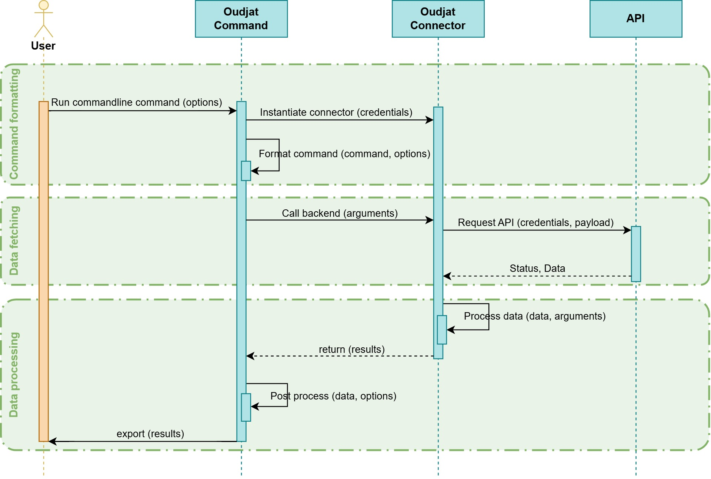

# Oudjat Command line usage

Below you can find details about Oudjat command line usage.
For now, Oudjat includes two operating modes.

1. 🐚Command Line (covered bellow)
2. ⚙️Configuration File (covered in its [dedicated doc file](./config_file)

## 📖Table of Contents

1. [Connectors](#connectors)
2. [Connectors.CERT.CERTFR](#connectors-cert-certfr)
3. [Connectors.EDR.Cybereason](#connectors-edr-cybereason)
4. [Connectors.EDR.SentinelOne](#connectors-edr-sentinelone)
5. [Connectors.Endoflife](#connectors-endoflife)
6. [Connectors.LDAP](#connectors-ldap)
7. [Connectors.MS.SCCM](#connectors-ms-sccm)
8. [Connectors.Tenable.SC](#connectors-tenable-sc)
9. [Connectors.Vulns](#connectors-vulns)

## 🔌Connectors

### 💡Description {#general-description}

The connector commands allow you to interact and query implemented connectors.

Basically:

1. The user runs a command
2. The command uses a certain connector backend function
3. The backend requests the associated API



> [!TIP]
> Some options / backends allow to do a bit more by combining other backends and API requests.
> This is to simplify / accelerate some operations that are not natively possible through native API operations.

- Auto loops
- Data consolidation
- Research / query forging
- Etc

Every implemented connector return data in the form of a list of dictionaries. Which you can

- filter
- print
- export.

### 🚀General usage {#general-usage}

To use one of oudjat connectors, you can reference it like this:

```bash
oudjat connectors.<connector_path> [options]
```

You will find every connector reference in their **dedicated command section**.

### 🎛️Options {#general-options}

Oudjat uses [docotp](http://docopt.org/) to handle its usages and command options. As well as printing help messages.

> [!IMPORTANT]
> The most important rule of docopt you need to know is:
> options wrapped with **parenthesis** () or not wrapped at all, are required.
> options wrappped with **brackets** [] are optional.

Each option is described under its **Options** section in help messages.
While the usages under the **Usage** section each describe a way you can use the script.

> [!HINT]
> You may often see the `[options]` string in usage lines.
> This is a shortcut to specify that you **can** use other options than the ones specified in the usage line.

> [!WARNING]
> If `[options]` is not present in the usage line, it means you have to strictly stick with the options mentioned in that line.
> If you use an options that is not mentioned in the line, it will either have no effect, or throw an error

The connectors commands **share some common operations** you can pass as options:

| Option                 | Description                                                                   |
| ---------------------- | ----------------------------------------------------------------------------- |
| -a --append            | Append to the output file. Useful if you want to append logs in the same file |
| -h --help              | Print the doc string                                                          |
| -v --verbose           | Show more logs                                                                |
| -o --output=LOGFILE    | Specify a file to save the execution logs                                     |
| -S --silent            | Simple output                                                                 |
| -V --version           | Show the program version and exit                                             |
| --csv=CSV              | Save results as CSV to the specified list of location                         |
| --json=JSON            | Save results as JSON to the specified list of location                        |
| --print                | Print the results in the terminal                                             |
| --key-filter=KEYFILTER | A list of keys to filter the final results with                               |
| --sort=SORTKEY         | A key to sort the result with                                                 |
| --sort-reverse         | Reverse the sorting order                                                     |

#### 🗄️Debug & Logs {#general-options-logs}

Oudjat handles logs through logging module.

> [!TIP]
> You can display more logs by using the `--verbose` option

> [!TIP]
> You can export logs into a file of your choosing using the `--output` option
> The `--append` option allows you to, well... Append logs to an existing log file

#### 📦JSON String {#general-options-json}

You will often see connectors with at least one option that expects a JSON string argument (e.g. `--payload`)

Provided JSON string must follow... Well, JSON syntax:

```json
{ "intAttribute": 10, "boolAttribute": true, "stringAttribute": "value" }
```

The JSON string must also be wrapped between **single quotes**:

```bash
oudjat connectors.<connector_ref> --usage --payload '{"attribute1": 2, "attribute2": "whatever"}'
```

> [!WARNING]
> Any invalid JSON will result with an error.

#### 📋Lists {#general-options-lists}

You may also come across several options that need a **list of elements**.

- IDs
- Names

> [!TIP]
> Any list can contain a single element as well as multiple ones. Because... It's a list alright...

> [!TIP]
> You can provide the list in two different ways

1. Provide the list directly

```bash
oudjat connectors.<connector_ref> --usage --names Rick,Roy,Pris
```

> [!IMPORTANT]
> Each element in the list must be separated by a comma, no space

2. Provide the list as a file

```bash
oudjat connectors.<connector_ref> --usage --names @./path/to/file.txt
```

> [!IMPORTANT]
> To specify that the list is a file, you must include an at sign **@** at the beginning of the argument value.
> Each line of the file will be considered a value. So one element (name, id, whatever) per line.
> The provided file can have any extension, as long as its content is clear text

#### 🔑Credentials {#general-options-creds}

In a lot of cases, the connector will require that you provide 🔑**credentials** to perform some form of 👤**authentication**.

Oudjat handles secrets through python keyring and the credential store available on your machine.
You can provide 🔑 with these options

| Option                  | Description                                                                                                         |
| ----------------------- | ------------------------------------------------------------------------------------------------------------------- |
| -u --username=USERNAME  | The username / login to use for the connection                                                                      |
| -p --password=PASSWORD  | The password to use for the connection                                                                              |
| --creds-service=SERVICE | Alternatively, you can provide a service name that will be used to store credentials for that particular connector. |

While using the `--creds-service` option, you can either:

- Provide a username to specifically connect with a certain user
- Provide no extra information. Oudjat will automatically retrieve ailable 🔑 for the specified service

When you specify a credential service name:

1. Oudjat will ask you for a username and password.

```bash
> oudjat connectors.ldap -t "server.domain.local" --creds-service "MyLDAPSrvConnection" ...
> Username for MyLDAPSrvConnection: <my_user>
> Password for MyLDAPSrvConnection: ************
```

2. It will then store the prompted 🔑 in the available credential store on your system:
   - 🐧**Linux**: KWallet, Gnome keyring, etc.
   - 🪟**Windows**: Windows Credential Store

The next time you use the same service, Oudjat will automatically retrieve the registered 🔑 for that service.

> [!Important]
> If multiple username/password pairs are registered for the same service. Oudjat will retrieve the last registered one.
> You can specify the username you want to retrieve credentials for.

So the credentials options are usually handled with the following docopt logic:
`(--username=USER --password=PASS | --creds-service=SERVICE [--username=USER])`

### 🆘Help {#general-help}

Each connector command options can be retrieved by combining the connector ref with the `--help` option like this:

```bash
oudjat connectors.<ref> -h
oudjat connectors.<ref> --help
```

Using the `--help` option without any connector reference, will just print the general help message

#### 📝Examples

Print general help:

```bash
oudjat -h
oudjat --help
```

Print help message for specific connectors:

```bash
oudjat connectors.edr.sentinelone --help
oudjat connectors.endoflife --help
```

---

## 🔌Connectors - CERT.CERTFR

### 💡Description {#certfr-description}

A connector used to parse [CERTFR pages](https://www.cert.ssi.gouv.fr/) .
It returns CERTFR pages content:

- Title
- Description
- Affected products
- Sources
- Risks
- CVEs

### 📚Reference {#certfr-ref}

`connectors.cert.certfr`

### ☑️Prerequisites {#certfr-prereq}

- No API key, nor special access is required.
- No credential are required either.
- You just need an internet access.

### 🚀Usage {#certfr-usage}

| Usage    | Description                                                 |
| -------- | ----------------------------------------------------------- |
| --target | Specify a CERTFR page ref to parse                          |
| --feed   | Automatically retrieve and parse CERTFR pages from RSS feed |

```bash
oudjat connectors.cert.certfr (-t=TARGET | --target=TARGET)
                              [--keywords=KEYWORDS]
                              [--max-cve [--limit=LIMIT]]
                              [options]
oudjat connectors.cert.certfr --feed
                              [--feed-date=FEEDDATE]
                              [--keywords=KEYWORDS]
                              [--max-cve [--limit=LIMIT]]
                              [options]
```

### 🎛️Options {#certfr-options}

| Option               | Description                                                                                           |
| -------------------- | ----------------------------------------------------------------------------------------------------- |
| --feed-date=FEEDDATE | A filter to retrieve only RSS feed items that were published after a certain date (YYYY-MM-DD format) |
| --limit=LIMIT        | Define a limit to the number of CVEs resolve when using max-cve option [default: 50]                  |
| --max-cve            | Resolve CVEs data and the highests (most critical) ones                                               |
| --keywords=KEYWORDS  | A list of keywords to match pages                                                                     |

> [!NOTE]
> You can optionally fetch data for the CVEs referenced in parsed pages using the `--max-cve` option.
> This will use CVE connectors for various CVE databases like Nist, CVE.org, and more to retrieve CVSS score and other CVE details.

> [!WARNING]
> Since CERTFR pages tend to have a lot of CVE references, you can limit how many are resolved with the `--limit` option.

### 📝Examples {#certfr-examples}

```bash
oudjat connectors.cert.certfr -t "CERTFR-2021-ALE-022" --max-cve --limit 20
oudjat connectors.cert.certfr --feed --date-filter "2025-12-01"
```

## 🔌Connectors - EDR.Cybereason

> [!WARNING]
> Cybereason connector is no longer maintained

## 🔌Connectors - EDR.Sentinelone

### 💡Description {#s1-description}

A connector to interact with [SentinelOne](https://www.sentinelone.com/fr/) EDR API.
It provides ability to do various actions:

- Retrieve data (agents, appliations, policies, groups, sites, threats, etc.)
- Move objects (agent to group, group to site)
- Update policies (group, site)
- Update threats status and verdict

### 📚Reference {#s1-ref}

`connectors.edr.sentinelone`

### ☑️Prerequisites {#s1-prereq}

You will need several elements to use this connector:

1. An account on SentinelOne console
2. An API token
3. The required permissions to query the endpoints you want to reach

> [!IMPORTANT]
> 🔑Credentials are needed for this connector. See [general credentials](#general-options-creds) section.
> For this connector, the password is the API token

### 🚀Usage {#s1-usage}

> [!CAUTION]
> Some commands (usages) bellow can have a significant impact on your asssets
> Whether, you want to change a policy, move an asset, change a threat status, etc. It can have direct or indirect consequences
> Trade with the usages marked with ❗ carefully !

| Usage                     | Description                                                                       |
| ------------------------- | --------------------------------------------------------------------------------- |
| --agents                  | Export S1 agents details                                                          |
| --agents-export           | Export flat agent data                                                            |
| --move-agent-site         | ❗Move one or multiple agents to a site based on its id                           |
| --threats                 | Retrieve threats detected by S1                                                   |
| --threats-verdict         | ❗Change the verdict of filtered threats                                          |
| --threats-incident        | ❗Change the verdict and status of filtered threats                               |
| --alert-verdict           | ❗Change the verdict of filtered alerts                                           |
| --alert-incident          | ❗Change the status of filtered alerts                                            |
| --applications            | Retrieve an inventory of applications detected by S1                              |
| --applications-endpoints  | Retrieve an inventory of endpoints for a specific application                     |
| --applications-with-risks | Retrieve an inventory of applications detected by S1 that present a security risk |
| --applications-cves       | Retrieve CVEs for specific application(s)                                         |
| --cves                    | Retrieve CVEs detected by S1                                                      |
| --groups                  | Retrieve groups                                                                   |
| --group-policy            | Retrieve the policy of a specific group                                           |
| --group-policy-update     | ❗Update the policy of the specified groups                                       |
| --group-move-agent        | ❗Move agents into specified group                                                |
| --sites                   | Retrieve sites                                                                    |
| --sites-by-name           | Retrieve sites by names                                                           |

❗: Usage that can impact your environment. Use carefully

```bash
oudjat connectors.edr.sentinelone --agents
                                  (-t=TARGET | --target=TARGET)
                                  (--username=USER --password=PASS | --creds-service=SERVICE [--username=USER])
                                  [--sites-list=SITES]
                                  [--payload=PAYLOAD]
                                  [options]
oudjat connectors.edr.sentinelone --agents-export
                                  (-t=TARGET | --target=TARGET)
                                  (--username=USER --password=PASS | --creds-service=SERVICE [--username=USER])
                                  [--sites-list=SITES]
                                  [--payload=PAYLOAD]
                                  [options]
oudjat connectors.edr.sentinelone --move-agent-site
                                  (-t=TARGET | --target=TARGET)
                                  (--username=USER --password=PASS | --creds-service=SERVICE [--username=USER])
                                  [--sites-list=SITES]
                                  [--names=NAMES]
                                  [options]
oudjat connectors.edr.sentinelone --threats
                                  (-t=TARGET | --target=TARGET)
                                  (--username=USER --password=PASS | --creds-service=SERVICE [--username=USER])
                                  [--sites-list=SITES]
                                  [--payload=PAYLOAD]
                                  [options]
oudjat connectors.edr.sentinelone --threats-verdict
                                  (-t=TARGET | --target=TARGET)
                                  (--username=USER --password=PASS | --creds-service=SERVICE [--username=USER])
                                  [--verdict=VERDICT]
                                  [--ids=IDS]
                                  [--sites-list=SITES]
                                  [--status-filter=STATUSFILTER]
                                  [--verdict-filter=VERDICTFILTER]
                                  [--path=PATH]
                                  [--filter=FILTER]
                                  [options]
oudjat connectors.edr.sentinelone --threats-incident
                                  (-t=TARGET | --target=TARGET)
                                  (--username=USER --password=PASS | --creds-service=SERVICE [--username=USER])
                                  (--status=STATUS --verdict=VERDICT)
                                  [--ids=IDS]
                                  [--sites-list=SITES]
                                  [--status-filter=STATUSFILTER]
                                  [--verdict-filter=VERDICTFILTER]
                                  [--path=PATH]
                                  [--auto]
                                  [--filter=FILTER]
                                  [options]
oudjat connectors.edr.sentinelone --alert-verdict
                                  (-t=TARGET | --target=TARGET)
                                  (--username=USER --password=PASS | --creds-service=SERVICE [--username=USER])
                                  [--verdict=VERDICT]
                                  [--ids=IDS]
                                  [--sites-list=SITES]
                                  [--status-filter=STATUSFILTER]
                                  [--verdict-filter=VERDICTFILTER]
                                  [--path=PATH]
                                  [--filter=FILTER]
                                  [options]
oudjat connectors.edr.sentinelone --alert-incident
                                  (-t=TARGET | --target=TARGET)
                                  (--username=USER --password=PASS | --creds-service=SERVICE [--username=USER])
                                  [--status=STATUS]
                                  [--ids=IDS]
                                  [--sites-list=SITES]
                                  [--status-filter=STATUSFILTER]
                                  [--verdict-filter=VERDICTFILTER]
                                  [--path=PATH]
                                  [--auto]
                                  [--filter=FILTER]
                                  [options]
oudjat connectors.edr.sentinelone --applications
                                  (-t=TARGET | --target=TARGET)
                                  (--username=USER --password=PASS | --creds-service=SERVICE [--username=USER])
                                  [--names=NAMES]
                                  [--vendors=VENDOR]
                                  [--sites-list=SITES]
                                  [--payload=PAYLOAD]
                                  [options]
oudjat connectors.edr.sentinelone --applications-endpoints
                                  (-t=TARGET | --target=TARGET)
                                  (--username=USER --password=PASS | --creds-service=SERVICE [--username=USER])
                                  [--names=NAMES]
                                  [--vendors=VENDOR]
                                  [--sites-list=SITES]
                                  [--payload=PAYLOAD]
                                  [options]
oudjat connectors.edr.sentinelone --applications-with-risks
                                  (-t=TARGET | --target=TARGET)
                                  (--username=USER --password=PASS | --creds-service=SERVICE [--username=USER])
                                  [--vendors=VENDOR]
                                  [--sites-list=SITES]
                                  [--payload=PAYLOAD]
                                  [options]
oudjat connectors.edr.sentinelone --applications-cves
                                  (-t=TARGET | --target=TARGET)
                                  (--username=USER --password=PASS | --creds-service=SERVICE [--username=USER])
                                  [--ids=IDS]
                                  [--names=NAMES]
                                  [--vendors=VENDORS]
                                  [--sites-list=SITES]
                                  [--payload=PAYLOAD]
                                  [options]
oudjat connectors.edr.sentinelone --cves
                                  (-t=TARGET | --target=TARGET)
                                  (--username=USER --password=PASS | --creds-service=SERVICE [--username=USER])
                                  [--ids=IDS]
                                  [--severities=SEVERITIES]
                                  [--sites-list=SITES]
                                  [--payload=PAYLOAD]
                                  [options]
oudjat connectors.edr.sentinelone --groups
                                  (-t=TARGET | --target=TARGET)
                                  (--username=USER --password=PASS | --creds-service=SERVICE [--username=USER])
                                  [--names=NAMES]
                                  [--sites-list=SITES]
                                  [--payload=PAYLOAD]
                                  [options]
oudjat connectors.edr.sentinelone --group-policy
                                  (-t=TARGET | --target=TARGET)
                                  (--username=USER --password=PASS | --creds-service=SERVICE [--username=USER])
                                  [--ids=IDS]
                                  [options]
oudjat connectors.edr.sentinelone --group-policy-update
                                  (-t=TARGET | --target=TARGET)
                                  (--username=USER --password=PASS | --creds-service=SERVICE [--username=USER])
                                  [--ids=IDS]
                                  [--malicious-policy=MALPOLICY]
                                  [--suspicious-policy=SUPOLICY]
                                  [--payload=PAYLOAD]
                                  [options]
oudjat connectors.edr.sentinelone --group-move-agent
                                  (-t=TARGET | --target=TARGET)
                                  (--username=USER --password=PASS | --creds-service=SERVICE [--username=USER])
                                  [--ids=IDS]
                                  [--names=NAMES]
                                  [--payload=PAYLOAD]
                                  [options]
oudjat connectors.edr.sentinelone --sites
                                  (-t=TARGET | --target=TARGET)
                                  (--username=USER --password=PASS | --creds-service=SERVICE [--username=USER])
                                  [--payload=PAYLOAD]
                                  [options]
oudjat connectors.edr.sentinelone --sites-by-name
                                  (-t=TARGET | --target=TARGET)
                                  (--username=USER --password=PASS | --creds-service=SERVICE [--username=USER])
                                  [--names=NAMES]
                                  [--payload=PAYLOAD]
                                  [options]
```

> [!IMPORTANT]
> Each usage matches a specific SentinelOne endpoint.

### 🎛️Options {#s1-options}

| Option                                  | Description                                                                |
| --------------------------------------- | -------------------------------------------------------------------------- |
| -t --target=TARGET                      | Specify the SentinelOne URL to query                                       |
| --auto                                  | Trigger auto mode. See the doc for full usage details                      |
| --auto-mitigation-action=AUTOMITIGATION | Specify the automatic mitigation action                                    |
| --ids=IDS                               | A list of IDs to narrow down selection. See the doc for full usage details |
| --malicious-policy=MALPOLICY            | Specify the malicious policy for a group or agent                          |
| --names=NAMES                           | A list of names to narrow down selection                                   |
| --path=PATH                             | A path of a file or process to narrow down selection                       |
| --payload=PAYLOAD                       | A JSON payload to pass additional query parameters                         |
| --severities=SEVERITIES                 | A list severity numbers                                                    |
| --sites-list=SITES                      | A list of site IDs or names                                                |
| --status=STATUS                         | Specify an incident status to an alert or a threat                         |
| --status-filter=STATUSFILTER            | A list of incident statuses for alert/threat selection                     |
| --suspicious-policy=SUPOLICY            | Specify the suspicious policy for a group or agent                         |
| --vendors=VENDORS                       | A list of application vendor for CVEs/application selection                |
| --verdict=VERDICT                       | Specify an incident analyst verdict to an alert or a threat                |
| --verdict-filter=VERDICTFILTER          | a list of incident statuses for alert/threat selection                     |

> [!IMPORTANT]
> Some of the options listed above expect a [JSON string](#general-options-json) argument

- `--payload`
  - The payload is basically what is sent in the request.
  - So it can contain any attribute accepted by the SentinelOne endpoint.
  - In theory, you only need the payload option to do whatever you want with every usage.
  - For ease of use, some parameters have their dedicated option

So...

```bash
oudjat connectors.edr.sentinelone --group-policy-update --ids 01234567890 --payload '{"data": {"maliciousPolicy": "protect"}}'
```

Is equivalent to this...

```bash
oudjat connectors.edr.sentinelone --group-policy-update --ids 01234567890 --malicious-policy protect
```

> [!TIP]
> The value passed with the dedicated argument will always override what you pass inside the payload

So let's say you run this command:

```bash
oudjat connectors.edr.sentinelone -t "myurl.sentinelone.net" --creds-service "S1API" --group-policy-update --ids 01234567890 --malicious-policy protect --payload '{"data": {"maliciousPolicy": "detect"}}'
```

- The policy is set to **detect** in the payload
- But the dedicated option set it to **protect**

> [!WARNING]
> Please check the SentinelOne API documentation to know which parameters you can pass and how they must be formatted.

### 📝Examples {#s1-examples}

```bash
# Export agents details into a json file
oudjat connectors.edr.sentinelone -t "myurl.sentinelone.net" --creds-service "S1API" --agents --json ./agents.json

# Change the policy of one or multiple groups
oudjat connectors.edr.sentinelone -t "myurl.sentinelone.net" --creds-service "S1API" --group-policy-update --ids "@./group_ids.txt" --malicious-policy protect
```

## 🔌Connectors - Endoflife

### 💡Description {#eol-description}

A connector to retrieve data from [endoflife](https://endoflife.date/) API.
Endoflife.date is a website that documents end of life and support lifecycles for various products.

- Applications
- Databases
- Devices
- Frameworks
- Operating Systems
- Server Applications
- Services
- Standards

### 📚Reference {#eol-ref}

`connectors.endoflife`

### ☑️Prerequisites {#eol-prereq}

- No API key, nor special access is required.
- No credential are required either.
- You just need an 🌐internet access.

### 🚀Usage {#eol-usage}

| Usage              | Description                                 |
| ------------------ | ------------------------------------------- |
| --products         | Retrieve all or a specific product from EOL |
| --product-releases | Retrieve a product release from EOL         |
| --linux            | Retrieve linux related products             |
| --windows          | Retrieve windows related products           |
| --windows-server   | Retrieve windows server related products    |
| --categories       | Retrieve product categories                 |
| --apps             | Retrieve app category products              |
| --oses             | Retrieve os category products               |
| --tags             | Retrieve all, or a specific tag             |

```bash
oudjat connectors.endoflife --products [--product-name=PRODUCTNAME] [--tag=TAG]... [--full] [options]
oudjat connectors.endoflife --product-releases [--product-name=PRODUCTNAME] [--release-name=RELNAME] [options]
oudjat connectors.endoflife --linux [--full] [options]
oudjat connectors.endoflife --windows [options]
oudjat connectors.endoflife --windows-server [options]
oudjat connectors.endoflife --categories [--category-name=CTGNAME] [options]
oudjat connectors.endoflife --apps [options]
oudjat connectors.endoflife --oses [options]
oudjat connectors.endoflife --tags [--tag=TAG] [options]
```

### 🎛️Options {#eol-options}

| Option                     | Description                              |
| -------------------------- | ---------------------------------------- |
| --category-name=CTGNAME    | Specify a product category name          |
| --full                     | If specified, retrieve full product data |
| --product-name=PRODUCTNAME | Specify a product name                   |
| --release-name=RELNAME     | Specify a release name (its version)     |
| --tag=TAG                  | Specify one or several tag (repeatable)  |

### 📝Examples {#eol-examples}

```bash
oudjat connectors.endoflife --products --product-name LibreOffice --json ./libreoffice.json
oudjat connectors.endoflife --windows --csv ./windows.csv
```

## 🔌Connectors - LDAP

### 💡Description {#ldap-description}

A connector to extract data from an [LDAP](https://en.wikipedia.org/wiki/Lightweight_Directory_Access_Protocol) directory.

The connector provides ways to extract various objects:

- Users
- Computers
- Groups
- Organizational Units (OU)
- Group Policy Objects (GPO)
- Subnets

> [!IMPORTANT]
> This connector currently does not provide any way to write or edit objects in the directory.

### 📚Reference {#ldap-ref}

`connectors.ldap`

### ☑️Prerequisites {#ldap-prereq}

You will need the following elements to use this connector:

- A valid and active account in the directory you want to extract data from
- Permission given to this account to read directory data

> [!IMPORTANT]
> 🔑Credentials are needed for this connector. See [general credentials](#general-options-creds) section.

### 🚀Usage {#ldap-usage}

| Usage     | Description                                                                      |
| --------- | -------------------------------------------------------------------------------- |
| computers | Retrieve computer accounts                                                       |
| gpos      | Retrieve Group Policy Objects                                                    |
| groups    | Retrieve group objects                                                           |
| objects   | Retrieve any type of LDAP objects. Result depends heavily on the provided filter |
| ous       | Retrieve Organizational Unit objects                                             |
| subnets   | Retrieve subnet objects                                                          |
| users     | Retrieve user accounts                                                           |

```bash
oudjat connectors.ldap --computers
                       (-t=TARGET | --target=TARGET)
                       (--username=USER --password=PASS | --creds-service=SERVICE [--username=USER])
                       [--attributes=ATTRIBUTES]
                       [--search-base=SEARCHBASE]
                       [--dn=DN]
                       [--name=NAME]
                       [--filter=FILTER]
                       [options]
oudjat connectors.ldap --gpos
                       (-t=TARGET | --target=TARGET)
                       (--username=USER --password=PASS | --creds-service=SERVICE [--username=USER])
                       [--displayname=DISPLAYNAME]
                       [--name=NAME]
                       [--search-base=SEARCHBASE]
                       [--filter=FILTER]
                       [--attributes=ATTRIBUTES]
                       [options]
oudjat connectors.ldap --groups
                       (-t=TARGET | --target=TARGET)
                       (--username=USER --password=PASS | --creds-service=SERVICE [--username=USER])
                       [--attributes=ATTRIBUTES]
                       [--search-base=SEARCHBASE]
                       [--dn=DN]
                       [--name=NAME]
                       [--filter=FILTER]
                       [options]
oudjat connectors.ldap --objects
                       (-t=TARGET | --target=TARGET)
                       (--username=USER --password=PASS | --creds-service=SERVICE [--username=USER])
                       [--attributes=ATTRIBUTES]
                       [--search-base=SEARCHBASE]
                       [--dn=DN]
                       [--name=NAME]
                       [--filter=FILTER]
                       [options]
oudjat connectors.ldap --ous
                       (-t=TARGET | --target=TARGET)
                       (--username=USER --password=PASS | --creds-service=SERVICE [--username=USER])
                       [--attributes=ATTRIBUTES]
                       [--search-base=SEARCHBASE]
                       [--name=NAME]
                       [--filter=FILTER]
                       [options]
oudjat connectors.ldap --subnets
                       (-t=TARGET | --target=TARGET)
                       (--username=USER --password=PASS | --creds-service=SERVICE [--username=USER])
                       [--attributes=ATTRIBUTES]
                       [--search-base=SEARCHBASE]
                       [--filter=FILTER]
                       [options]
oudjat connectors.ldap --users
                       (-t=TARGET | --target=TARGET)
                       (--username=USER --password=PASS | --creds-service=SERVICE [--username=USER])
                       [--attributes=ATTRIBUTES]
                       [--search-base=SEARCHBASE]
                       [--dn=DN]
                       [--name=NAME]
                       [--filter=FILTER]
                       [options]
```

### 🎛️Options {#ldap-options}

| Option                    | Description                                                |
| ------------------------- | ---------------------------------------------------------- |
| -t --target=TARGET        | Specify the LDAP server to query                           |
| --attributes=ATTRIBUTES   | Provide additional attributes to retrieve from server      |
| --displayname=DISPLAYNAME | The GPO display name                                       |
| --dn=DN                   | DistinguishedName(s) to narrow down elements research      |
| --filter=FILTER           | Provide an LDAP filter string to narrow down results       |
| --name=NAME               | Name(s) to narrow down elements research                   |
| --san=SAN                 | SAMAccountName(s) to narrow down elements research         |
| --search-base=SEARCHBASE  | Where to base the search on in terms of directory location |

#### Filter {#ldap-options-filter}

> [!TIP]
> Options for this connector are mostly trivial (No JSON string or complex object).
> Except for the `--filter` option, which allows you to pass a custom **LDAP filter** to narrow down query results.

You can check this [cheatsheet](https://gist.github.com/jonlabelle/0f8ec20c2474084325a89bc5362008a7) to learn everything you need about LDAP filters

> [!IMPORTANT]
> Basically, an LDAP filter is formatted like this : `(<attribute><operator><value>)`.

| Operator | Meaning                  |
| :------: | ------------------------ |
|   `=`    | Equality                 |
|   `>=`   | Greater than or equal to |
|   `<=`   | Less than or equal to    |
|   `~=`   | Approximately equal to   |

You can combine filters using either:

- **AND** operator `&`
- **OR** operator `|`
- **NOT** operator `!`

You will find more details and examples in the **cheatsheet** above

#### Usage filter {#ldap-options-usg-filter}

The [usages](#ldap-usage) mentioned earlier have implicit filters.

| Usage     | Description                                  |
| --------- | -------------------------------------------- |
| computers | (objectCategory=computer)                    |
| gpos      | (objectClass=groupPolicyContainer)           |
| groups    | (objectCategory=group)                       |
| objects   | (objectClass=*)                              |
| ous       | (objectClass=organizationalUnit)             |
| subnets   | (objectClass=subnet)                         |
| users     | (&(objectCategory=person)(objectClass=user)) |

Which means that the filter you provide with `--filter` or other options will be **combined** with the one bound to the usage you call.

So...

```bash
oudjat connectors.ldap -t ldap.mydomain.local --creds-service SvcLDAP --computers --name Skynet
```

Or...

```bash
oudjat connectors.ldap -t ldap.mydomain.local --creds-service SvcLDAP --computers --filter "(name=Skynet)"
```

Will end up with this combined filter:

```text
(&(objectCategory=computer)(name=Skynet))
```

> [!TIP]
> If you want to do a generic search, use `--objects` which will basically retrieve any type of object.
> You can then use other options to narrow down the results.

### 📝Examples {#ldap-examples}

```bash
oudjat connectors.ldap -t ldap.mydomain.local --creds-service SvcLDAP --users --filter (sAMAccountName=r.batty)
oudjat connectors.ldap -t ldap.mydomain.local --creds-service SvcLDAP --users --dn "@./users.txt"
oudjat connectors.ldap -t ldap.mydomain.local --creds-service SvcLDAP --gpos --displayname MY-GPO
oudjat connectors.ldap -t ldap.mydomain.local --creds-service SvcLDAP --computers --name Skynet,Wintermute,R2D2
```

## 🔌Connectors - SCCM

> [!IMPORTANT]
> 🔨 Please note that this connector is a work in progress

### 💡Description {#sccm-description}

A connector that allows to query an SCCM server through [ODBC](https://en.wikipedia.org/wiki/Open_Database_Connectivity).

> [!WARNING]
> Currently, this connector is considered semi-safe

Because every SCCM SQL database is different, it is difficult to write a backend that would work for at least a majority.
So currently the connector just provides a way to send an SQL query as plain text.

> [!IMPORTANT]
> For security purpose, the connector check for suspicious parameters. Especially when a format dictionary is provided
> If no format dictionary is provided, the query is interpreted as pure text

### 📚Reference {#sccm-ref}

`connectors.ms.sccm`

### ☑️Prerequisites {#sccm-prereq}

You will need the following elements to use this connector:

- A valid account that has access to the SCCM server you want to query
- Permission given to this account to query and read data from the SCCM database

> [!IMPORTANT]
> 🔑Credentials are needed for this connector. See [general credentials](#general-options-creds) section.

### 🚀Usage {#sccm-usage}

| Usage  | Description                       |
| ------ | --------------------------------- |
| target | Query the specified target server |

```bash
oudjat connectors.sccm (-t=TARGET | --target=TARGET)
                       (--username=USER --password=PASS | --creds-service=SERVICE [--username=USER])
                       (--db=DBNAME)
                       (-q=QUERY | --query=QUERY)
                       [--driver=DRIVER]
                       [--format=FORMAT]
                       [options]
```

### 🎛️Options {#sccm-options}

| Option             | Description                       |
| ------------------ | --------------------------------- |
| -t --target=TARGET | Specify the target server         |
| -q --query=QUERY   | Specify the SQL query file        |
| --db=DBNAME        | The name of the database to query |
| --driver=DRIVER    | The ODBC driver to use            |
| --format=FORMAT    | A format JSON dictionary          |

### 📝Examples {#sccm-examples}

```bash
oudjat connectors.sccm -t sccm.mydomain.local --db MySCCMDB --creds-service SCCMODBC --query ./my_query.sql
```

## 🔌Connectors - Tenable.SC

### 💡Description {#tsc-description}

### 📚Reference {#tsc-ref}

`connectors.tenable.sc`

### ☑️Prerequisites {#tsc-prereq}

### 🚀Usage {#tsc-usage}

| Usage | Description |
| ----- | ----------- |

```bash
```

### 🎛️Options {#tsc-options}

| Option | Description |
| ------ | ----------- |

### 📝Examples {#tsc-examples}

```bash
```

## 🔌Connectors - 🌐Vulns

### 💡Description {#vuln-description}

### 📚Reference {#vuln-ref}

``

### ☑️Prerequisites {#vuln-prereq}

### 🚀Usage {#vuln-usage}

| Usage | Description |
| ----- | ----------- |

```bash
```

### 🎛️Options {#vuln-options}

| Option | Description |
| ------ | ----------- |

### 📝Examples {#vuln-examples}

```bash
```

---

## 🛠️Utils

## 🛠️Utils - Credentials
